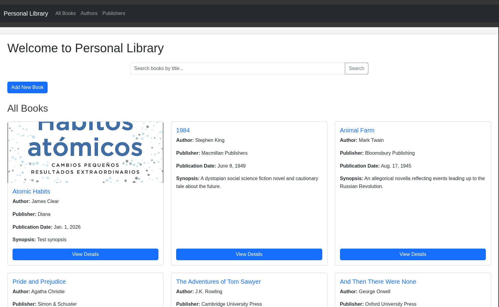
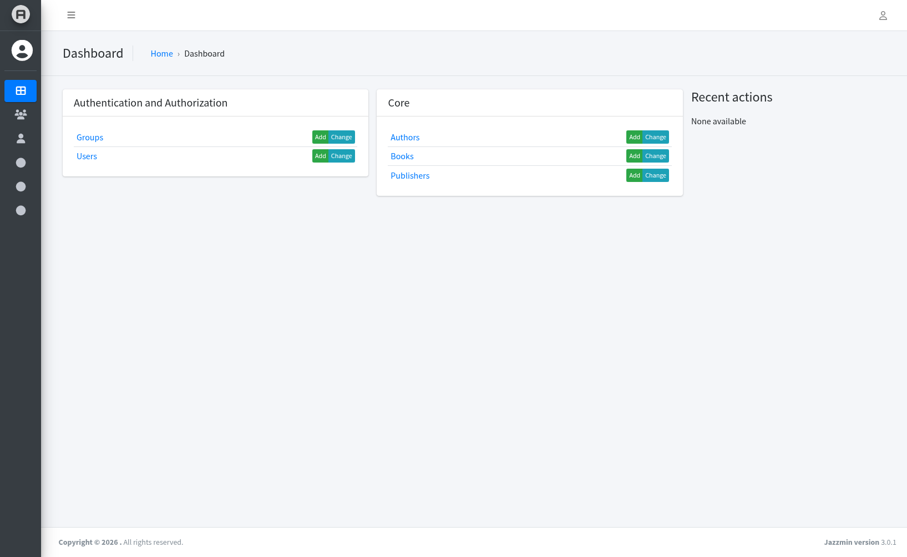

# Personal Library

Aplicación web Django para gestionar una biblioteca personal con libros, autores y editoriales.

## Descripción

Esta aplicación permite gestionar una colección personal de libros, incluyendo información sobre autores y editoriales. Cuenta con funcionalidades para crear, leer, actualizar y eliminar registros de libros, autores y editoriales.


## Características

- Gestión completa de libros (CRUD)
- Gestión de autores y editoriales
- Búsqueda de libros
- Vista detallada de cada registro
- API REST para operaciones de datos
- Panel de administración de Django Jazzmin



## Requisitos

- Python 3.12 o superior con pip
- uv (gestor de entornos virtuales)

## Instalación

1. Clona este repositorio:
   ```bash
   git clone https://github.com/Tenvid/PersonalLibrary.git
   cd PersonalLibrary
   ```

2. Asegúrate de tener `uv` instalado:
   ```bash
   curl -LsSf https://astral.sh/uv/install.sh | sh
   ```

3. Crea y activa el entorno virtual:
   ```bash
   uv venv
   source .venv/bin/activate  # En Windows: .venv\Scripts\activate
   ```

4. Instala las dependencias:
   ```bash
   uv sync
   ```

## Configuración

1. Navega al directorio del proyecto Django:
   ```bash
   cd personal_library
   ```

2. Realiza las migraciones iniciales:
   ```bash
   python manage.py migrate
   ```

3. Crea un superusuario (opcional):
   ```bash
   python manage.py createsuperuser
   ```

## Ejecución

1. Desde el directorio `personal_library`, inicia el servidor de desarrollo:
   ```bash
   python manage.py runserver
   ```

2. Abre tu navegador y visita:
   - Aplicación: `http://127.0.0.1:8000/`
   - Panel de administración: `http://127.0.0.1:8000/admin/`



## Estructura del Proyecto

- `personal_library/`: Proyecto Django principal
- `core/`: Aplicación que contiene los modelos y vistas
- `manage.py`: Comando principal de Django
- `pyproject.toml`: Dependencias del proyecto

## API

La aplicación incluye una API REST con los siguientes endpoints:

- `/api/books/` - Listar/crear libros
- `/api/books/<id>/` - Obtener/actualizar/eliminar libro específico
- `/api/authors/` - Listar/crear autores
- `/api/authors/<id>/` - Obtener/actualizar/eliminar autor específico
- `/api/publishers/` - Listar/crear editoriales
- `/api/publishers/<id>/` - Obtener/actualizar/eliminar editorial específica


## Contribución

Las contribuciones son bienvenidas. Por favor, abre un issue o envía un pull request para sugerir cambios.

## Licencia
Este proyecto está bajo la Licencia Apache 2.0. Consulta el archivo LICENSE para más detalles.
